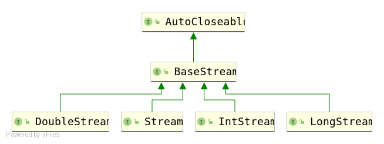
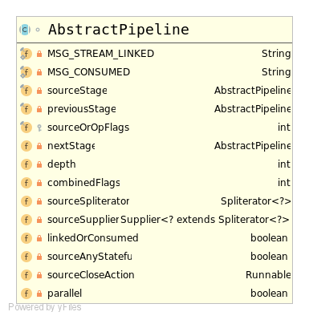
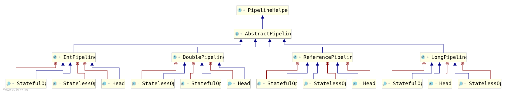
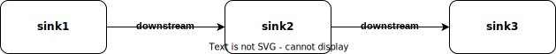

# 1 `Stream`的使用

在深入学习`Stream`的本质之前，我们需要先熟悉`Stream`的使用规则。对`Stream`有了整体的认识之后，才能更好的理解它的本质。

## 1.1 使用步骤

使用`Stream`只需要遵循**3个步骤**：

1. 创建流。
2. 逻辑处理。
3. 收集结果。

例如，我们需要考试分数大于60分的人数：

```java
// 考试分数数组
int[] nums = new int[]{59,59,59,59,59,59,60,60,98,99,100};
// 第一步：创建流
IntStream numsStream = Arrays.stream(nums);
// 第二部：逻辑处理：过滤考试分数大于等于60分的元素
IntStream filteredStream = numsStream.filter(num -> num >= 60);
// 第三步：收集结果：计算元素个数
long count = filteredStream.count();
System.out.println(count);  // 5
```

其中，逻辑处理步骤又称为**中间操作**（intermediate operations）。中间操作可以由多个步骤组成，例如我们可能还需要统计其中男生的人数，则可以再添加一个`flter()`处理步骤。

收集结果步骤又称为**终止操作**（terminal operations）。执行终止操作后就意味着该流程结束了，因此一个流在处理过程中只能有一个终止操作。如果此时再次执行中间操作或终止操作，则会抛出`java.lang.IllegalStateException`。

学习怎么使用`Stream`，其实就是学习这三个步骤对应的API，以及它们对应的逻辑。

## 1.2 辨别API

如何辨别创建、中间操作和终止操作API：

- 创建：将其他类型数据（如数组）转换成流，如`method(int[]):Stream`。
- 中间操作：将旧流转换成新流，如`method(Stream):Stream`。
- 终止操作：将流转换成其他类型数据：如`method(Stream):int`。

# 2 基于`BaseStream`的接口体系

在谈论Java SE 8引入的流库时，我们通常会称呼它为`Stream`。

实际上，`Stream`只是Java SE 8流库中的其中一类工具，专门用来处理引用类型的流处理。

就好比IO流中既有`InputStream`一类专门读取字节流的工具，也有`Reader`一类专门读取字符流的工具。

## 2.1 `BaseStream`

Java SE 8引入的流库的构建于以`BaseStream`为核心的接口体系之上：



`BaseStream`中定义了所有流都具备的通用方法：

- `iterator():Iterator<T>` 获取元素的迭代器
- `spliterator():Spliterator<T>` 获取元素的分离器
- `isParallel():boolean` 判断是否是并行流
- `sequential():S` 将当前流转换成顺序流
- `parallel():S` 将当前流转换成并行流
- `unordered():S` 将当前流转换成无序流
- `onClose(Runnable):S` 添加关闭流事件
- `close()` 关闭流，此时所有关闭流事件都会触发

## 2.2 针对不同数据类型的扩展

根据处理数据类型的不同，在`BaseStream`的基础之上进一步扩展出`IntStream`、`LongStream`、`DoubleStream`以及`Stream`等子接口。

这些子接口所提供的方法在使用逻辑上都没有什么差别，只是由于它们所操作的元素类型不同，底层实现逻辑也有所不同。

顾名思义，`IntStream`、`LongStream`和`DoubleStream`分别是对`int`、`long`和`double`基本数据类型进行处理的流。如：

```java
int[] ints = new int[]{1,2,3,4,5,6,7,8,9};
IntStream intStream = Arrays.stream(ints);
int intSum = intStream.sum();
long[] longs = new long[]{1L,2L,3L,4L,5L,6L,7L,8L,9L};
LongStream longStream = Arrays.stream(longs);
long longSum = longStream.sum();
double[] doubles = new double[]{1.0D,2.0D,3.0D,4.0D,5.0D,6.0D,7.0D,8.0D,9.0D};
DoubleStream doubleStream = Arrays.stream(doubles);
double doubleSum = doubleStream.sum();
System.out.println(intSum); // 45
System.out.println(longSum);    // 45
System.out.println(doubleSum);  // 45.0
```

而`Stream`则是对引用数据类型类型进行处理的流。如：

```java
String[] strings = new String[]{"Hello", ", ", "Stream", "!"};
Stream<String> stringStream = Arrays.stream(strings);
long count = stringStream.count();
System.out.println(count);  // 4
```

此时，我们可以发现。针对元素数据类型性质的不同，这些子接口所扩展的方法也有所不同：

- 所有子接口都扩展了诸如`filter()`、`map()`、`flatMap()`、`distinct()`、`sorted()`和`of()`等通用方法。
- 所有子接口都扩展了转化成其他流的方法，如`Stream`提供了`mapToInt()`、`mapToLong()`和`mapToDouble()`，而`IntStream`提供了`mapToObj()`、`mapToLong()`和`mapToDouble()`。
- 针对数值数据类型的特性，`IntStream`、`LongStream`和`DoubleStream`子接口提供了`sum()`、`average()`和`summaryStatistics()`等数值计算方法，而`Stream`则没有。
- `IntStream`、`LongStream`和`DoubleStream`子接口提供了将元素转型成对应包装类的方法`boxed()`。

## 2.3 处理其他基本数据类型

我们可以发现这么一个问题，JDK只对`int`、`long`和`double`这三种基本数据类型提供了对应的流接口。那么如果需要处理基本数据类型元素（`byte`、`short`、`char`、`float`和`boolean`)），我们该怎么处理呢？

有些人可能会尝试使用`Stream`进行处理，但此时会将整个数组当作是一个元素进行处理：

```java
byte[] bytes = new byte[]{1,2,3,4,5,6,7,8,9};
Stream<byte[]> byteStream = Stream.of(bytes);
System.out.println(byteStream.count()); // 1
```

实际上，JDK并没有提供这方面的支持。由于类型自动提升，它允许使用`IntStream`处理`byte`、`short`、`char`、和`boolean`，使用`DoubleStream`处理`float`。

我们也可以转换一下思路，提供对应包装类的数组即可：

```java
Byte[] bytes = new Byte[]{1,2,3,4,5,6,7,8,9};
Stream<Byte> byteStream = Stream.of(bytes);
System.out.println(byteStream.count()); // 9
```

# 3 基于`AbstractPipeline`的继承结构

上一节讨论的是流的接口，规定了流的操作逻辑和API。

为了理解流的实现，我们需要深入学习流的数据结构，也就是它们的类结构。

## 3.1 `AbstractPipeline`

流的数据结构的实现基于`AbstractPipeline`。顾名思义，流的底层实现是基于**管道**（pipeline）的。通过后续对源码的阅读，我们会发现它是一个双向链表：


`AbstractPipeline`类图如下：



除了两个用于提示消息的静态变量，其他核心成员变量如下：

- `sourseStage`：管道的源阶段，源阶段对象指向自身。
- `previousStage`：当前阶段的上个阶段，源阶段对象没有上个阶段，指向`null`。
- `nextStage`：当前阶段的下个阶段，管道最后一个阶段没有下个阶段，指向`null`。
- `sourceOrOpFlags`：当前对象所处阶段的标志（源阶段、中间操作阶段或终止操作阶段），本质上就是记录当前对象在整个管道中所在的位置（第一个、中间或最后一个）。详细查看`StreamOpFlag`枚举类。
- `depth`：主要用于解析时定位当前对象所处调用队列深度，本质上是前面待执行阶段对象的个数。顺序流为前面中间操作的个数，并行流为前面状态操作的个数。
- `combinedFlags`：主要用于解析时确定当前对象所需要执行的中间操作，是源阶段标志和前面所有中间操作标志的结合。
- `sourceSpliterator`：数据源元素分隔器，用于获取单个元素。只有源阶段对象中的才会起作用。
- `sourceSupplier`：数据源元素提供器，封装了数据源。只有源阶段对象中的才会起作用。
- `linkedOrConsumed`：标志管道是链接状态还是终止状态。
- `sourceAnyStateful`：标记管道是否存在状态操作。只有源阶段对象中的才会起作用。
- `sourceCloseAction`：关闭流事件。
- `parallel`：标记管道是顺序流还是并行流。只有源阶段对象中的才会起作用。

## 3.2 不同数据类型的实现

在此基础之上，JDK针对`int`、`long`、`double`以及引用类型元素，提供了对应的实现类。继承结构如下：



其中，`XxxPipeline`表示对应的管道，而各自的内部类`Head`表示源阶段，`StatelessOp`和`StatefulOp`分别表示无状态和有状态的中间操作阶段。

此时，我们可以将流的逻辑结构更加具体化：


需要注意的是，`Head`内部类是具体的，因为对于某种数据类型的流操作来说，它的初始状态都是固定的，只需要保存数据源即可。

而`StatelessOp`和`StatefulOp`内部类却是抽象类，因为中间操作的数量和逻辑是不确定的。为了便于中间操作的扩展，需要定义为抽象的，需要具体某个逻辑时再实现`opWrapSink()`、`opEvaluateParallel()`以及`opEvaluateParallelLazy()`方法即可。

在这里我们以针对引用类型元素的`ReferencePipeline`为例，进行说明。

它的源阶段（`Head`内部类）只是实现了对应的抽象方法，并没有新增额外的成员变量。源码如下：

```java
/**
 * Source stage of a ReferencePipeline.
 *
 * @param <E_IN> type of elements in the upstream source
 * @param <E_OUT> type of elements in produced by this stage
 * @since 1.8
 */
static class Head<E_IN, E_OUT> extends ReferencePipeline<E_IN, E_OUT> {
    /**
     * Constructor for the source stage of a Stream.
     *
     * @param source {@code Supplier<Spliterator>} describing the stream source
     * @param sourceFlags the source flags for the stream source, described in {@link StreamOpFlag}
     */
    Head(Supplier<? extends Spliterator<?>> source,
         int sourceFlags, boolean parallel) {
        super(source, sourceFlags, parallel);
    }

    /**
     * Constructor for the source stage of a Stream.
     *
     * @param source {@code Spliterator} describing the stream source
     * @param sourceFlags the source flags for the stream source, described in {@link StreamOpFlag}
     */
    Head(Spliterator<?> source,
         int sourceFlags, boolean parallel) {
        super(source, sourceFlags, parallel);
    }

    @Override
    final boolean opIsStateful() {
        throw new UnsupportedOperationException();
    }

    @Override
    final Sink<E_IN> opWrapSink(int flags, Sink<E_OUT> sink) {
        throw new UnsupportedOperationException();
    }

    // Optimized sequential terminal operations for the head of the pipeline

    @Override
    public void forEach(Consumer<? super E_OUT> action) {
        if (!isParallel()) {
            sourceStageSpliterator().forEachRemaining(action);
        }
        else {
            super.forEach(action);
        }
    }

    @Override
    public void forEachOrdered(Consumer<? super E_OUT> action) {
        if (!isParallel()) {
            sourceStageSpliterator().forEachRemaining(action);
        }
        else {
            super.forEachOrdered(action);
        }
    }
}
```

它的无状态中间操作阶段（`StatelessOp`内部类）仅实现了部分抽象方法：

```java
/**
 * Base class for a stateless intermediate stage of a Stream.
 *
 * @param <E_IN> type of elements in the upstream source
 * @param <E_OUT> type of elements in produced by this stage
 * @since 1.8
 */
abstract static class StatelessOp<E_IN, E_OUT>
        extends ReferencePipeline<E_IN, E_OUT> {
    /**
     * Construct a new Stream by appending a stateless intermediate
     * operation to an existing stream.
     *
     * @param upstream The upstream pipeline stage
     * @param inputShape The stream shape for the upstream pipeline stage
     * @param opFlags Operation flags for the new stage
     */
    StatelessOp(AbstractPipeline<?, E_IN, ?> upstream,
                StreamShape inputShape,
                int opFlags) {
        super(upstream, opFlags);
        assert upstream.getOutputShape() == inputShape;
    }

    @Override
    final boolean opIsStateful() {
        return false;
    }
}
```

他的有状态中间操作（`StatefulOp`内部类）除了实现部分抽象方法，还提供了与并行流处理相关的`opEvaluateParallel()`方法。源码如下：

```java
/**
 * Base class for a stateful intermediate stage of a Stream.
 *
 * @param <E_IN> type of elements in the upstream source
 * @param <E_OUT> type of elements in produced by this stage
 * @since 1.8
 */
abstract static class StatefulOp<E_IN, E_OUT>
        extends ReferencePipeline<E_IN, E_OUT> {
    /**
     * Construct a new Stream by appending a stateful intermediate operation
     * to an existing stream.
     * @param upstream The upstream pipeline stage
     * @param inputShape The stream shape for the upstream pipeline stage
     * @param opFlags Operation flags for the new stage
     */
    StatefulOp(AbstractPipeline<?, E_IN, ?> upstream,
               StreamShape inputShape,
               int opFlags) {
        super(upstream, opFlags);
        assert upstream.getOutputShape() == inputShape;
    }

    @Override
    final boolean opIsStateful() {
        return true;
    }

    @Override
    abstract <P_IN> Node<E_OUT> opEvaluateParallel(PipelineHelper<E_OUT> helper,
                                                   Spliterator<P_IN> spliterator,
                                                   IntFunction<E_OUT[]> generator);
}
```

# 4 详细解析流的创建、中间操作和终止操作

## 4.1 创建流：`StreamSupport`工具类

`StreamSupport`是一个用来创建和操作流的基础工具类，它提供了创建各种数据类型流的静态方法：

- `stream()`：创建`Stream<T>`
- `intStream()`：创建`IntStream`
- `longStream()`：创建`LongStream`
- `doubleStream()`：创建`DoubleStream`

这些方法并没有十分深奥，它们进行是对各种`Head`内部类的构造函数进行了封装。例如：

```java
public static <T> Stream<T> stream(Spliterator<T> spliterator, boolean parallel) {
    Objects.requireNonNull(spliterator);
    return new ReferencePipeline.Head<>(spliterator,
                                        StreamOpFlag.fromCharacteristics(spliterator),
                                        parallel);
}
```

许多创建流API的内部都使用该工具类，例如`java.util.Collection#stream`方法源码如下：

```java
default Stream<E> stream() {
    return StreamSupport.stream(spliterator(), false);
}
```

如果需要创建并行流，则会设置`Head`对象的`parallel`成员变量为`true`。例如：

```java
default Stream<E> parallelStream() {
    return StreamSupport.stream(spliterator(), true);
}
```

顺序流和并行流，在创建和中间操作阶段，都仅仅是`Head`对象的`parallel`成员变量而已。

## 4.2 中间操作

本质上，中间操作是对管道这个双向链表添加新节点的操作：

1. 创建`StatelessOp`或`StatefulOp`中间操作阶段的新节点。
2. 将新节点链接到管道尾部。
3. 返回新节点。

事实确实如此，以`java.util.stream.ReferencePipeline#filter`为例，它会创建`StatelessOp`中间操作：

```java
public final Stream<P_OUT> filter(Predicate<? super P_OUT> predicate) {
    Objects.requireNonNull(predicate);
    return new StatelessOp<P_OUT, P_OUT>(this, StreamShape.REFERENCE,
                                 StreamOpFlag.NOT_SIZED) {
        @Override
        Sink<P_OUT> opWrapSink(int flags, Sink<P_OUT> sink) {
            return new Sink.ChainedReference<P_OUT, P_OUT>(sink) {
                @Override
                public void begin(long size) {
                    downstream.begin(-1);
                }

                @Override
                public void accept(P_OUT u) {
                    if (predicate.test(u))
                        downstream.accept(u);
                }
            };
        }
    };
}
```

其中，该中间操作的逻辑会被保存到`opWrapSink()`方法返回的匿名`Sink`对象中。

只有等到终止操作时，才会遍历这些对象，进行对应的业务逻辑操作。所以说**流的操作时尽可能惰性执行的**。

## 4.3 终止操作

执行了终止操作，意味着需要遍历管道的所有阶段，按照各个中间操作处理数据源。

终止操作的核心在于`java.util.stream.AbstractPipeline#evaluate(java.util.stream.TerminalOp<E_OUT,R>)`方法。

例如，我们需要考试分数大于60分的总分数：

```java
// 考试分数数组
int[] nums = new int[]{59,59,59,59,59,59,60,60,98,99,100};
// 第一步：创建流
IntStream numsStream = Arrays.stream(nums);
// 第二部：逻辑处理：过滤考试分数大于等于60分的元素
IntStream filteredStream = numsStream.filter(num -> num >= 60);
// 第三步：收集结果：计算元素的加和
long sum = filteredStream.reduce(0, Integer::sum);
System.out.println(sum);  // 417
```

`java.util.stream.IntPipeline#reduce(int, java.util.function.IntBinaryOperator)`是一个终止操作：

```java
public final int reduce(int identity, IntBinaryOperator op) {
    return evaluate(ReduceOps.makeInt(identity, op));
}
```

它会调用`evaluate()`方法：

```java
final <R> R evaluate(TerminalOp<E_OUT, R> terminalOp) {
    assert getOutputShape() == terminalOp.inputShape();
    // 校验当前流对象是否已经终止
    if (linkedOrConsumed)
        throw new IllegalStateException(MSG_STREAM_LINKED);
    linkedOrConsumed = true;
    // 判断顺序流或并行流，进行对应处理
    return isParallel()
           ? terminalOp.evaluateParallel(this, sourceSpliterator(terminalOp.getOpFlags()))
           : terminalOp.evaluateSequential(this, sourceSpliterator(terminalOp.getOpFlags()));
}
```

`isParallel()`方法会校验管道源阶段对象的`parallel`成员变量：

```java
public final boolean isParallel() {
    return sourceStage.parallel;
}
```

如果是并行流，它会创建不同的`java.util.concurrent.CountedCompleter`实现类对象进行执行任务。

如果是顺序流，则会按顺序调用中间操作进行处理。在这个过程中需要获取每个中间操作保存的执行逻辑，核心在于`java.util.stream.AbstractPipeline#wrapSink`方法：

```java
final <P_IN> Sink<P_IN> wrapSink(Sink<E_OUT> sink) {
    Objects.requireNonNull(sink);

    for ( @SuppressWarnings("rawtypes") AbstractPipeline p=AbstractPipeline.this; p.depth > 0; p=p.previousStage) {
        sink = p.opWrapSink(p.previousStage.combinedFlags, sink);
    }
    return (Sink<P_IN>) sink;
}
```

这里的`Sink`对象保存着中间操作的执行逻辑，它本质上是一个**单向链表**，具体可以查看`java.util.stream.Sink`接口的内部类。例如：

```java
static abstract class ChainedReference<T, E_OUT> implements Sink<T> {
    protected final Sink<? super E_OUT> downstream;
}
```

在`wrapSink()`方法中会沿着流管道，从终止操作往前遍历，构筑出完整的`Sink`单向链表对象：



然后就会按顺序执行这些`sink`中定义的方法，处理数据源。例如`java.util.stream.AbstractPipeline#copyInto`：

```java
final <P_IN> void copyInto(Sink<P_IN> wrappedSink, Spliterator<P_IN> spliterator) {
    Objects.requireNonNull(wrappedSink);

    if (!StreamOpFlag.SHORT_CIRCUIT.isKnown(getStreamAndOpFlags())) {
        wrappedSink.begin(spliterator.getExactSizeIfKnown());
        spliterator.forEachRemaining(wrappedSink);
        wrappedSink.end();
    }
    else {
        copyIntoWithCancel(wrappedSink, spliterator);
    }
}
```

# 5 解析数据源：`Spliterator<T>`分隔器

在上述讲解过程中，我们可以发现：在创建流的过程中并没有将数据源直接保存起来，而是会使用一个叫`Spliterator`的接口将其封装起来。

这么做的原因是：数据源的格式太多，且未来可继续扩展。不可能在`AbstractPipeline`中针对每种数据源都进行处理，只能抽取出一个抽象层，规定了遍历元素的方法，而具体逻辑由实现类制定。

我们在执行`sink`中定义的方法时，会调用到`Spliterator`的`forEachRemaining()`方法，它会遍历数据源，进行逻辑处理：

```java
default void forEachRemaining(Consumer<? super T> action) {
    do { } while (tryAdvance(action));
}
```

具体如何遍历数据源和逻辑处理，要看数据源对应的`Spliterator`实现类。

例如`java.util.ArrayList.ArrayListSpliterator`既重写了`forEachRemaining()`方法：

```java
public void forEachRemaining(Consumer<? super E> action) {
    int i, hi, mc; // hoist accesses and checks from loop
    ArrayList<E> lst; Object[] a;
    if (action == null)
        throw new NullPointerException();
    if ((lst = list) != null && (a = lst.elementData) != null) {
        if ((hi = fence) < 0) {
            mc = lst.modCount;
            hi = lst.size;
        }
        else
            mc = expectedModCount;
        if ((i = index) >= 0 && (index = hi) <= a.length) {
            for (; i < hi; ++i) {
                @SuppressWarnings("unchecked") E e = (E) a[i];
                action.accept(e);
            }
            if (lst.modCount == mc)
                return;
        }
    }
    throw new ConcurrentModificationException();
}
```

也实现了`tryAdvance()`方法：

```java
public boolean tryAdvance(Consumer<? super E> action) {
    if (action == null)
        throw new NullPointerException();
    int hi = getFence(), i = index;
    if (i < hi) {
        index = i + 1;
        @SuppressWarnings("unchecked") E e = (E)list.elementData[i];
        action.accept(e);
        if (list.modCount != expectedModCount)
            throw new ConcurrentModificationException();
        return true;
    }
    return false;
}
```

# 6 执行顺序的本质

需要注意的是，`Sink<T>`接口继承了`Consumer<T>`接口。而在中间操作中往往会按递归调用的方式实现`accept()`方法：

```java
public final Stream<P_OUT> filter(Predicate<? super P_OUT> predicate) {
    Objects.requireNonNull(predicate);
    return new StatelessOp<P_OUT, P_OUT>(this, StreamShape.REFERENCE,
                                 StreamOpFlag.NOT_SIZED) {
        @Override
        Sink<P_OUT> opWrapSink(int flags, Sink<P_OUT> sink) {
            return new Sink.ChainedReference<P_OUT, P_OUT>(sink) {
                @Override
                public void begin(long size) {
                    downstream.begin(-1);
                }

                @Override
                public void accept(P_OUT u) {
                    if (predicate.test(u))
                        downstream.accept(u);
                }
            };
        }
    };
}
```

因此，只需要执行一次`action.accept(e)`，就会执行所有中间操作。

此时，我们也可以发现一个很有趣的问题：**流在实际执行过程中，会一次性对每个元素执行所有中间操作**。伪代码如下：

```java
// 数据源
int[] source;
// 中间操作链表
Consumer action;
for (int i = 0; i < size; ++i) {
    // 获取当前元素
    int e = source[i];
    // 一次性执行所有中间操作
    action.accept(e);
}
```

